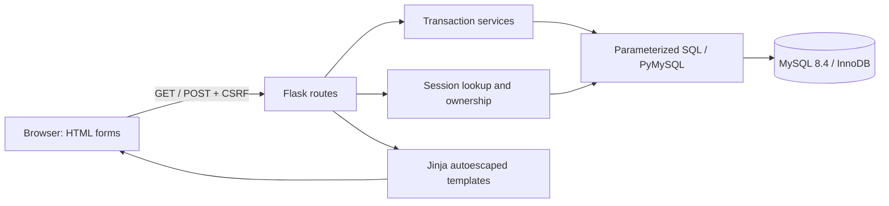
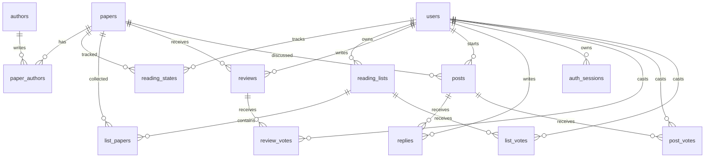

# Architecture and data model

There is no ORM or client application framework. Read queries are explicit. `g` owns a connection for each request; it is closed at teardown. Autocommit is used for independent statements, with explicit transactions around multi-statement business operations. Connection or lock failures return a generic 503 without exposing SQL arguments or credentials.

## Relationships

`login_attempts` is a separate short-lived operational log keyed by a hash of the remote address. The schema has 15 tables: seven core tables, two authentication tables, three discussion tables and three vote tables.

| Relation | Key / invariant | Delete policy |
|---|---|---|
| papers | ID; unique source_key; bounded year; nonempty title | Referenced papers cannot be deleted |
| authors | ID; names are not unique | Referenced authors cannot be deleted |
| paper_authors | (paper, author); unique (paper, order); positive order | Restrict parent deletion |
| users | ID; case-insensitive unique normalized email | Personal records cascade if deleted by a future administrative workflow |
| reading_states | (user, paper); allowed status; version | User cascade; paper restrict |
| reading_lists | ID; unique (owner, name); version | User cascade |
| list_papers | (list, paper) | List cascade; paper restrict |
| reviews | ID; unique (user, paper); integer rating 1–5 | User cascade; paper restrict |
| posts | ID; bounded title/body; version | User cascade; paper restrict |
| replies | ID; one parent post, no nested parent reply | Post/user cascade |
| auth_sessions | SHA-256 token digest; expiry | User cascade |

Timestamps use UTC. Titles/names are not identifiers. Foreign keys ensure existence but cannot authorize an HTTP caller. Private list routes check ownership with a uniform 404 for a missing or foreign list. Separate public read routes require is_public=TRUE and omit reading_states entirely. Publishing and unpublishing require owner authorization, a row lock and an expected version.

The email normalization policy is lowercase + trim for this account system, with MySQL's case/accent-insensitive collation. It is not an attempt to perfectly model every international email provider. Real-paper deduplication and author identity resolution are future ingestion concerns; fixture source keys are stable local identifiers.

## Atomic list additions

1. Begin transaction.
2. Find the current user's list with `SELECT ... FOR UPDATE`.
3. Process each distinct requested paper ID; reject a nonexistent paper.
4. Insert membership, treating only the membership unique-key duplicate as a no-op.
5. Increment list version if new members were added; commit.
6. On any exception, roll back every insert in the batch.

All implemented membership edits and list deletion lock the same list row. This serializes operations on one list without locking every user's lists. Unique keys remain the final data-integrity guard; transaction existence alone does not prevent a check-then-insert race. MySQL handles deadlocks; the app rolls back and asks the caller to retry instead of retrying arbitrary side effects automatically.

## Reading progress and stale writes

The browser submits an expected `version`. Existing progress is updated with `WHERE user_id=? AND paper_id=? AND version=?` and `version=version+1`. Zero affected rows means a stale writer and returns 409. Simultaneous first writes are protected by the composite primary key. This prevents silent lost updates, but users must reload after conflicts.

## Authentication and input safety

Werkzeug scrypt hashes passwords. A signed, HttpOnly, SameSite=Lax cookie holds an opaque session token; only its SHA-256 digest and expiry are stored in MySQL. Login rotates identity and clears the old CSRF state. Logout removes the DB row, invalidating a copied old cookie. Sessions last at most 12 hours. CSRF applies to every POST, including login and logout.

No client-supplied user ID is trusted. SQL values are bound parameters; internally generated placeholder lists and fixed SQL identifiers are the only SQL string composition. Literal substring search escapes `%` and `_`. Jinja escapes user text and no Markdown HTML is rendered. CSP disallows scripts and inline styles. Request and field sizes are bounded.

## Pagination and query choices

Filter papers using `EXISTS` for matching authors; do not paginate a joined paper-author result, which would count authors instead of papers. Fetch one page of papers, then fetch all their authors with one bounded `IN` query. This avoids N+1 queries and `GROUP_CONCAT` truncation. Ordering includes a stable ID tie-breaker. OFFSET pagination remains costly at deep pages; keyset pagination is a sensible future extension.

The list overview counts memberships and joins the current owner's progress, avoiding cross-user progress leakage. Paper reviews compute AVG directly from authoritative rows. Read pages are not a single transactionally frozen snapshot: counts and items can change between queries while other clients write.

## Community queries and hosting

Vote tables use composite (target,user) primary keys and cascading foreign keys. HTTP actions reject self-votes and private targets. Target-row locks serialize votes against deletion and visibility changes; idempotent insert/delete operations avoid duplicate counts on retries. Counts are aggregated from vote rows. Rating rankings preaggregate reviews before joining papers, use a minimum count filter, and have stable tie ordering. The coauthor graph uses a self-join and COUNT(DISTINCT paper_id), capped at 24 direct neighbors with a truncation notice and equivalent text table.

Cloud connections use an explicitly supplied CA with required certificate and hostname checks (TLS 1.2 minimum). TRUST_PROXY is opt-in and trusts one forwarded address/protocol hop, never forwarded Host. Hosted SECRET_KEY and database credentials belong in provider secrets. Render configuration uses its assigned PORT and an independent persistent MySQL service. See DEPLOYMENT.md for actual status; configuration alone is not evidence of a running deployment.

## Separate Sites edition

The user approved an additional Worker/D1 implementation under `web/`, not a replacement of this MySQL architecture. Platform ChatGPT authentication supplies identity; private data remains server-authorized. D1 atomic batches and conditional version predicates replace MySQL row locks. The schemas and stores are separate; MySQL benchmark evidence does not transfer to D1. See [lesson 17](lessons/11_TWO_EDITIONS.md) and [web architecture notes](../web/README.md).
